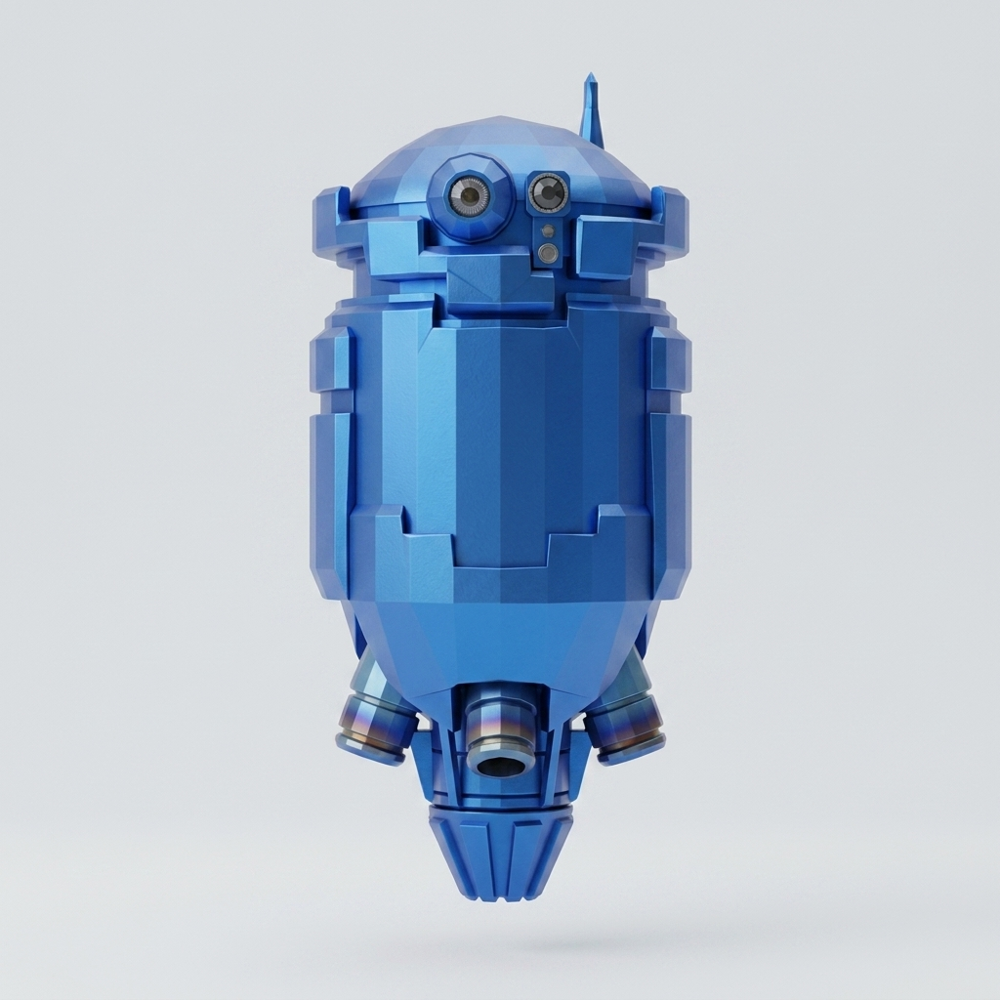

<p align="center">
  
</p>

# Klep2tron / Klep2tron

[](https://www.rust-lang.org/)
[](https://bevyengine.org/)

[🇺🇸 English](#english) | [🇺🇦 Українська](#українська)

---

<a name="english"></a>
## 🇺🇸 English

### Description
**Klep2tron** is a cross-platform 2.5D client-server game developed in Rust using the Bevy game engine. The game world is built on a multi-layered 3D grid (tile system) with an authoritative server that manages physics and world state.

### Project Structure
The project is organized as a Cargo Workspace and divided into the following components:
- `crates/shared` — Shared data structures (maps, tiles, protocols).
- `crates/server` — Authoritative headless server.
- `crates/editor_client` — Native desktop client and map editor.
- `crates/editor_client_web` — Web version of the client (WASM).
- `crates/admin_web` — Server administration panel (Axum).

### Installation and Setup

#### 1. Clone the Repository
```bash
git clone https://github.com/nudyk/klep2tron.git
cd klep2tron
```

#### 2. Install Dependencies

##### **Windows**
1. Install **Rust**:
   - **Command Line**: `winget install Rustlang.Rustup`
   - **Manual**: Download and run [rustup-init.exe](https://rustup.rs/).
2. Install **C++ Build Tools**: Download and run [Visual Studio Installer](https://visualstudio.microsoft.com/visual-cpp-build-tools/).

##### **macOS**
1. Install **Rust**:
   - **Command Line**:
     ```bash
     curl --proto '=https' --tlsv1.2 -sSf https://sh.rustup.rs | sh
     ```
   - **Manual**: Follow instructions on [rustup.rs](https://rustup.rs/).
2. Install Xcode Command Line Tools: `xcode-select --install`.

##### **Linux**
1. Install **Rust**:
   - **Command Line**:
     ```bash
     curl --proto '=https' --tlsv1.2 -sSf https://sh.rustup.rs | sh
     ```
   - **Manual**: Follow instructions on [rustup.rs](https://rustup.rs/).
2. Install development libraries for Bevy (graphics, audio, input).

*   **Debian / Ubuntu (Debian-like):**
    ```bash
    sudo apt update
    sudo apt install g++ pkg-config libx11-dev libasound2-dev libudev-dev libxcursor-dev libxi-dev libxrandr-dev libxinerama-dev libwayland-dev libxkbcommon-dev
    ```

*   **Arch / Manjaro (Arch-like):**
    ```bash
    sudo pacman -S pkgconf alsa-lib libx11 libxcursor libxi libxrandr libxinerama wayland libxkbcommon
    ```

*   **Fedora / RHEL (Red Hat-like):**
    ```bash
    sudo dnf install gcc-c++ pkgconf-pkg-config alsa-lib-devel libX11-devel libXcursor-devel libXi-devel libXrandr-devel libXinerama-devel wayland-devel libxkbcommon-devel
    ```

#### 3. Compilation and Run
To run the editor/client:
```bash
cargo run --bin editor_client
```
To run the server:
```bash
cargo run --bin server
```

---

<a name="українська"></a>
## 🇺🇦 Українська

### Опис
**Klep2tron** — це кросплатформна 2.5D клієнт-серверна гра, що розробляється мовою Rust з використанням ігрового рушія Bevy. Ігровий світ побудований на основі багаторівневої 3D-сітки (тайлової системи) з авторитарним сервером, який контролює фізику та стан світу.

### Структура проєкту
Проєкт організований як Cargo Workspace та розділений на наступні компоненти:
- `crates/shared` — Спільні структури даних (карти, тайли, протоколи).
- `crates/server` — Авторитарний headless-сервер.
- `crates/editor_client` — Нативний десктопний клієнт та редактор карт.
- `crates/editor_client_web` — Веб-версія клієнта (WASM).
- `crates/admin_web` — Панель керування сервером (Axum).

### Встановлення та запуск

#### 1. Клонування репозиторію
```bash
git clone https://github.com/nudyk/klep2tron.git
cd klep2tron
```

#### 2. Встановлення залежностей

##### **Windows**
1. Встановіть **Rust**:
   - **Командний рядок**: `winget install Rustlang.Rustup`
   - **Вручну**: Завантажте та запустіть [rustup-init.exe](https://rustup.rs/).
2. Встановіть **C++ Build Tools**: Завантажте та запустіть [Visual Studio Installer](https://visualstudio.microsoft.com/visual-cpp-build-tools/).

##### **macOS**
1. Встановіть **Rust**:
   - **Командний рядок**:
     ```bash
     curl --proto '=https' --tlsv1.2 -sSf https://sh.rustup.rs | sh
     ```
   - **Вручну**: Дотримуйтесь інструкцій на [rustup.rs](https://rustup.rs/).
2. Встановіть Xcode Command Line Tools: `xcode-select --install`.

##### **Linux**
1. Встановіть **Rust**:
   - **Командний рядок**:
     ```bash
     curl --proto '=https' --tlsv1.2 -sSf https://sh.rustup.rs | sh
     ```
   - **Вручну**: Дотримуйтесь інструкцій на [rustup.rs](https://rustup.rs/).
2. Встановіть бібліотеки для роботи Bevy (графіка, звук, ввід).

*   **Debian / Ubuntu (Debian-like):**
    ```bash
    sudo apt update
    sudo apt install g++ pkg-config libx11-dev libasound2-dev libudev-dev libxcursor-dev libxi-dev libxrandr-dev libxinerama-dev libwayland-dev libxkbcommon-dev
    ```

*   **Arch / Manjaro (Arch-like):**
    ```bash
    sudo pacman -S pkgconf alsa-lib libx11 libxcursor libxi libxrandr libxinerama wayland libxkbcommon
    ```

*   **Fedora / RHEL (Red Hat-like):**
    ```bash
    sudo dnf install gcc-c++ pkgconf-pkg-config alsa-lib-devel libX11-devel libXcursor-devel libXi-devel libXrandr-devel libXinerama-devel wayland-devel libxkbcommon-devel
    ```

#### 3. Компіляція та запуск
Для запуску редактора/клієнта:
```bash
cargo run --bin editor_client
```
Для запуску сервера:
```bash
cargo run --bin server
```
