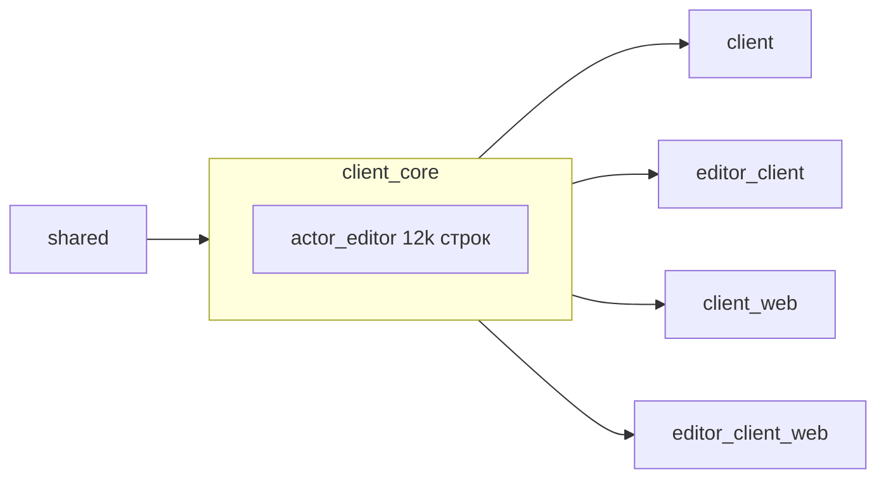
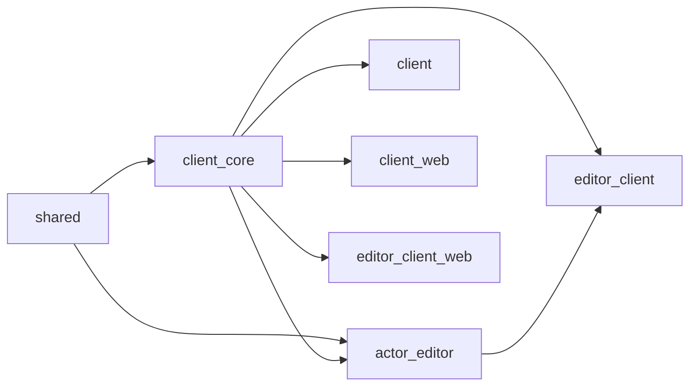

# 🛠 Вынос `actor_editor` в отдельный крейт

> **Статус:** ✅ Реализовано (Вариант B) — см. «Итог реализации» внизу
> **Дата:** 2026-09-26
> **Тип задачи:** Рефакторинг архитектуры (не фича)
> **Связанные документы:** [PROJECT_MAP.md](../../docs/PROJECT_MAP.md), [ROADMAP.md](../../docs/Future_Features/NPC/ActorEditor/todo/ROADMAP.md), [Actor_Storage_Format.md](../../docs/Actor_Storage_Format.md)

---

## 0. Проблема

`client_core` раздут: **11 857 строк из ~15 000** (56 файлов из ~80) — это редактор NPC-акторов, а не игровое ядро. Следствия:

1. **Игровой клиент `client` компилирует редактор.** Крейт `client` тянет `rfd`, `meshopt`, `rayon`, `bevy_hanabi`, `bevy_panorbit_camera` — всё ради редактора, которым он не пользуется.
2. **WASM не должен содержать редактор.** Уже сегодня пришлось вручную закрывать `actor_editor` через `#[cfg(not(target_arch = "wasm32"))]` в `lib.rs` (3 места) — симптом, а не решение.
3. **Дублирование имён.** `EditorMode` и `ActorEditorEntity` объявлены дважды (в `client_core/src/lib.rs` и в `actor_editor/mod.rs`), выбор между ними держится на приоритете явного элемента над glob-импортом. `ActorEditorEntity` в `lib.rs:78` — мёртвый код.
4. **Мёртвый реэкспорт.** `pub use crate::actor_editor::*;` в корне `client_core` протаскивает ~60 типов наружу.

### Замер связности (факты, не оценки)

Весь `actor_editor` ссылается на `client_core` **ровно двумя** сущностями:

| Сущность | Где определена | Как используется |
|---|---|---|
| `GameState` | `client_core/src/lib.rs:67` | `OnEnter(GameState::ActorEditor)`, `in_state(...)` |
| `reset_ambient_light` | `client_core/src/lib.rs:276` | `OnExit(GameState::ActorEditor)` |

Всё остальное (`crate::actor_editor::X`) — внутренние ссылки, при переезде превращаются в `crate::X`.
Внешние крейты (`editor_client` и др.) типы акторов **не импортируют** (только явный список из `client_core`).

---

## 1. Варианты решения

### Вариант A — feature-flag внутри `client_core`
Сделать `[features] actor_editor = [...]`, закрыть модуль `#[cfg(feature = "actor_editor")]`, `rfd`/`meshopt` — опциональные.

* **Плюсы:** минимум правок (~50 строк), быстро (30–60 мин).
* **Минусы:** 12k строк остаются в `client_core`; feature-флаги размазываются по Cargo.toml; параллельные фичи в workspace дают неожиданную унификацию; структура не улучшается.
* **Итог:** лечит симптомы (1) и (2), но не (3) и (4).

### Вариант B — отдельный крейт `actor_editor` (РЕКОМЕНДУЮ)
`crates/actor_editor` зависит от `client_core` (направление `shared ← client_core ← actor_editor`, без циклов). Плагин регистрируют бинарники, а не ядро.

* **Плюсы:** честное разделение; игровой `client` не компилирует редактор; wasm-гейты не нужны (крейт просто не подключают); дубли имён исчезают; `client_core` ужимается до ~3k строк.
* **Минусы:** механический переезд 56 файлов + правка импортов; ~2–4 часа.
* **Итог:** лечит все четыре пункта.

### Вариант C — полная развязка через `shared`
Дополнительно перенести `GameState` в `shared`, чтобы `actor_editor` не зависел от `client_core` вообще.

* **Плюсы:** идеальный DAG.
* **Минусы:** `GameState` — состояние *клиента*, в `shared` (клиент+сервер) ему не место; лишний churn.
* **Итог:** отвергаю.

**Рекомендация: Вариант B.**

---

## 2. Компоненты и сущности

* **Новый крейт:** `crates/actor_editor`
  * deps: `bevy 0.14`, `bevy_obj`, `bevy_panorbit_camera`, `bevy_mod_picking`, `bevy_hanabi`, `rfd`, `rayon`, `meshopt`, `ron`, `image`, `chrono`, `futures-lite`, `serde`, `serde_json`, `shared` (path), `client_core` (path)
  * нативно-только (не собирается под wasm32) — зависимость от `rfd`/`meshopt` это фиксирует явно.
* **Изменяемые файлы:**
  * `Cargo.toml` (workspace) — добавить member
  * `crates/client_core/src/lib.rs` — удалить `pub mod actor_editor`, реэкспорт, `add_plugins`, мёртвый `ActorEditorEntity`, убрать wasm-гейты (они станут не нужны)
  * `crates/editor_client/src/lib.rs` — добавить `.add_plugins(actor_editor::ActorEditorPlugin)`
  * `crates/editor_client/Cargo.toml`, `crates/editor_client_web/Cargo.toml` — новая зависимость
* **Сохраняются без изменений:** `MenuAction::OpenActorEditor`, `GameState::ActorEditor`, кнопка «ACTOR EDITOR» в `client_core/ui/menu/ui.rs` (ядро остаётся «оболочкой приложения», редактор лишь наполняет состояние системами).

---

## 3. Архитектура данных (до / после)

**До:**

**После:**

Ядро ничего не знает о редакторе; редактор — плагин, который подключает бинарник.

---

## 4. План интеграции

### Фаза 0 — Базовая линия
- [ ] Пользователь коммитит текущее чистое состояние (wasm-фикс + untrack `.gitignore`).
- [ ] Зафиксировать `cargo check` для native и обоих wasm-крейтов как эталон.

### Фаза 1 — Скелет крейта
- [ ] `cargo new --lib crates/actor_editor`, добавить в `workspace.members`.
- [ ] Перенести содержимое `crates/client_core/src/actor_editor/` в `crates/actor_editor/src/` (`git mv` для сохранения истории).
- [ ] Заголовок `lib.rs`: `pub mod ...` вместо `mod.rs`.

### Фаза 2 — Правка импортов (механическая)
Замены по всему новому крейту:
| Было | Стало |
|---|---|
| `crate::actor_editor::X` | `crate::X` |
| `crate::actor_editor::{...}` | `crate::{...}` |
| `super::super::X` (где X — корень редактора) | `crate::X` |
| `crate::GameState` / `crate::actor_editor::GameState` | `client_core::GameState` |
| `crate::reset_ambient_light` | `client_core::reset_ambient_light` |
| `crate::EditorMode` (внутри редактора) | локальный `crate::EditorMode` (свой тип, не путать с map-editor) |

### Фаза 3 — Отвязка ядра и подключение
- [x] `client_core/src/lib.rs`: убрать `pub mod actor_editor`, `pub use crate::actor_editor::*`, `.add_plugins(ActorEditorPlugin)` и wasm-`cfg`-обёртки; удалить мёртвый `struct ActorEditorEntity` (строка 78).
- [x] `editor_client`: `.add_plugins(actor_editor::ActorEditorPlugin)` (только для non-wasm).
- [x] `editor_client_web`: **не подключает** — зависимость `actor_editor` в `editor_client` объявлена под `cfg(not(target_arch = "wasm32"))`.
- [x] `client` (игра): **подключает** — отступление от черновика, см. «Итог реализации».

### Фаза 4 — Верификация и документация
- [ ] `cargo check --workspace` — чисто.
- [ ] `cargo check -p client_web --target wasm32-unknown-unknown` — чисто, **без** cfg-гейтов в ядре.
- [ ] `cargo run -p editor_client` — редактор открывается, импорт/слайсинг/сокеты работают (ручной smoke).
- [ ] Обновить `docs/PROJECT_MAP.md` (структура крейтов), `README.md` (список компонентов).
- [ ] Обновить `ROADMAP.md`: отметить 14.3 и 14.4 выполненными (код есть, галочки стоят неверно).

---

## 5. Риски и дегенеративные случаи

| Риск | Вероятность | Митигация |
|---|---|---|
| Циклическая зависимость `client_core ↔ actor_editor` | Средняя | Не возвращать реэкспорт/регистрацию в ядро. Плагин подключает только бинарник. |
| Крейт случайно собирается под wasm и падает на `rfd` | Средняя | Явно не добавлять `actor_editor` в web-крейты; при желании — `compile_error!` под wasm32. |
| Feature-унификация `bevy_*` между `client` и `editor_client` | Низкая | `client` не зависит от редактора, пересечения нет. |
| Потеря истории git при переезде | Низкая | Использовать `git mv`, не `rm` + `write`. |
| Конфликт имён `EditorMode`/`ActorEditorEntity` | Высокая (уже есть) | Переезд устраняет; проверить `cargo check` + grep на дубли. |

---

## 6. Тестирование

* **Компиляция:** 3 цели (native workspace, `client_web` wasm, `editor_client_web` wasm).
* **Отсутствие регрессий ядра:** размер `client_core` до/после (ожидается ~15k → ~3k строк).
* **Гарантия чистоты wasm:** в `client_core/src/lib.rs` не должно остаться ни одного `cfg(target_arch = "wasm32")`, связанного с редактором.
* **Ручной smoke:** полный цикл редактора — импорт модели → оптимизация → разрезание → сокеты → сохранение `.k2m` (см. `docs/Actor_Storage_Format.md`).

---

## 7. Оценка

* Трудоёмкость: **2–4 часа** аккуратной работы (в основном механические импорты).
* Критерий готовности: wasm собирается без ручных cfg-заглушек; дубли имён удалены; ядро не знает о редакторе; документация обновлена.

---

## 8. Итог реализации

**Сделано (2026-09-26):**
- Создан крейт `crates/actor_editor` (56 файлов, 11 857 строк), переезд через `git mv` — история сохранена, git видит ренаймы.
- `client_core` ужат **14 966 → 3 107 строк**; в нём не осталось ни одного упоминания редактора и ни одного связанного с ним wasm-`cfg`.
- Направление зависимостей: `shared ← client_core ← actor_editor ← {client, editor_client}`. Циклов нет.
- Удалён мёртвый `ActorEditorEntity` из ядра; дубли имён `EditorMode` / `ActorEditorEntity` устранены (остались только в `actor_editor`).
- Были нужны ровно 2 связи с ядром: `GameState` и `reset_ambient_light` (`client_core::`).

**Кнопка «ACTOR EDITOR» — исправлено (вторая итерация):**
Изначально кнопка была **захардкожена** в `client_core/ui/menu/ui.rs` под `#[cfg(not(wasm32))]` и вела в `GameState::ActorEditor`. Любой бинарник без плагина редактора получал мёртвую кнопку. Исправление:
- Кнопка убрана из ядра. Теперь `ExtraMenuButtons` — единственный механизм добавления кнопок, и его расширили до `(label, action, tooltip)`.
- `editor_client` сам объявляет кнопки «LEVEL EDITOR» и «ACTOR EDITOR» (с тултипами).
- `client` (игра) **не подключает** `actor_editor` и не объявляет кнопку — мёртвое состояние невозможно по построению: кнопка появляется только там, где есть плагин (ручная связка в одном месте бинарника).
- Так план соблюдён: редактор не компилируется в игре (`cargo tree -p client` — 0 вхождений `actor_editor`).

**Верификация:** `cargo check --workspace` (native), `-p client_web --target wasm32-unknown-unknown`, `-p editor_client_web --target wasm32-unknown-unknown` — все чисто, 0 warning'ов в коде проекта.
