# Диаграммы архитектуры оптимизации слайсера

## 1. Текущая архитектура (До оптимизации)

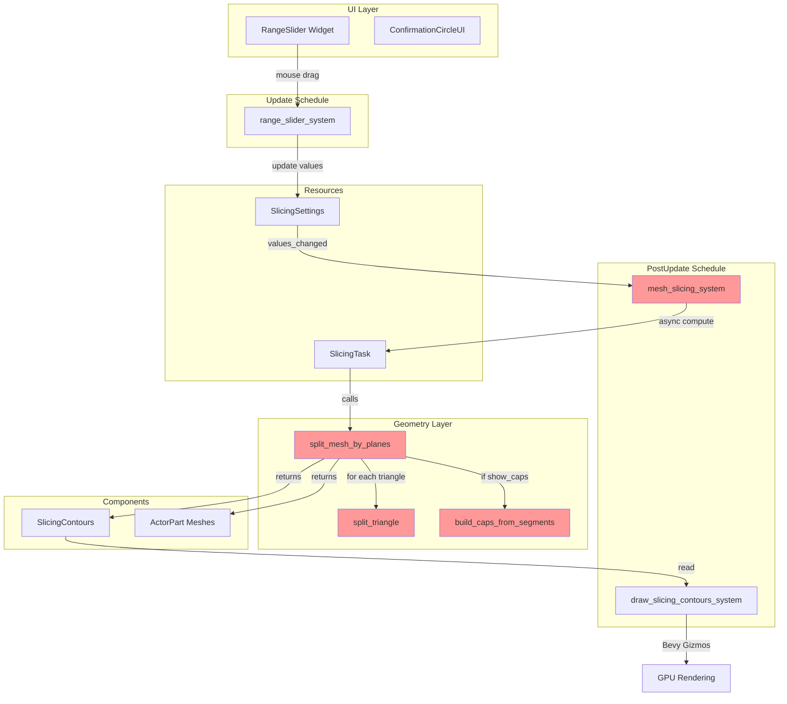

### Проблемы текущей архитектуры

1. **Каждое движение ползунка** → Полное разрезание меша (50-200ms)
2. **Связанное выполнение** → Контуры ждут завершения разрезания
3. **Нет preview режима** → Пользователь не видит результат до завершения
4. **Механизм подтверждения не используется** → `needs_confirm` не предотвращает вычисления

---

## 2. Оптимизированная архитектура (Гибридный подход)

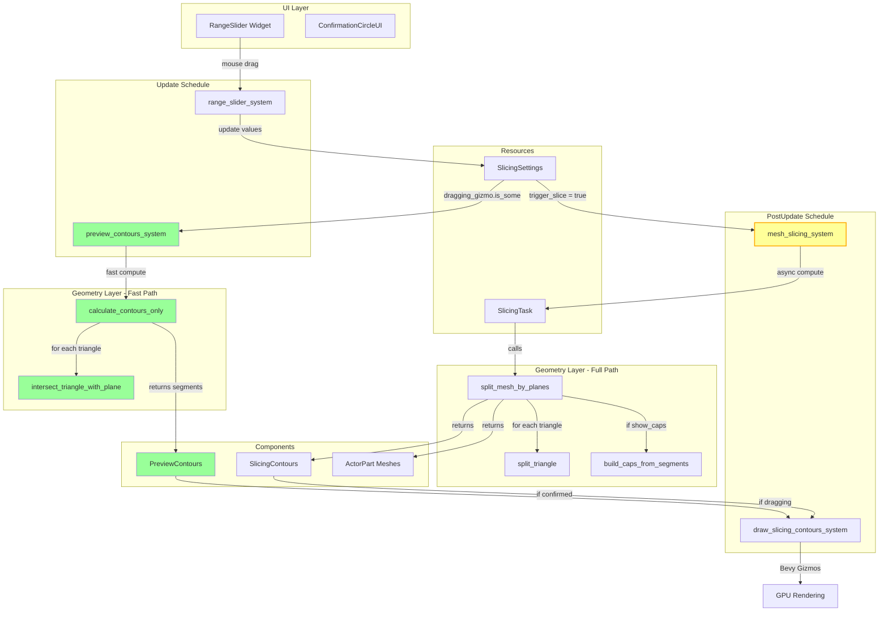

### Преимущества оптимизированной архитектуры

1. **Preview режим** → Быстрые контуры (5-10ms) во время перетаскивания
2. **Разделение путей** → Fast path для preview, Full path для финала
3. **Условное выполнение** → Полное разрезание только при подтверждении
4. **Визуальная обратная связь** → Мгновенное обновление контуров

---

## 3. Диаграмма потока данных

### Сценарий 1: Перетаскивание ползунка (Preview Mode)

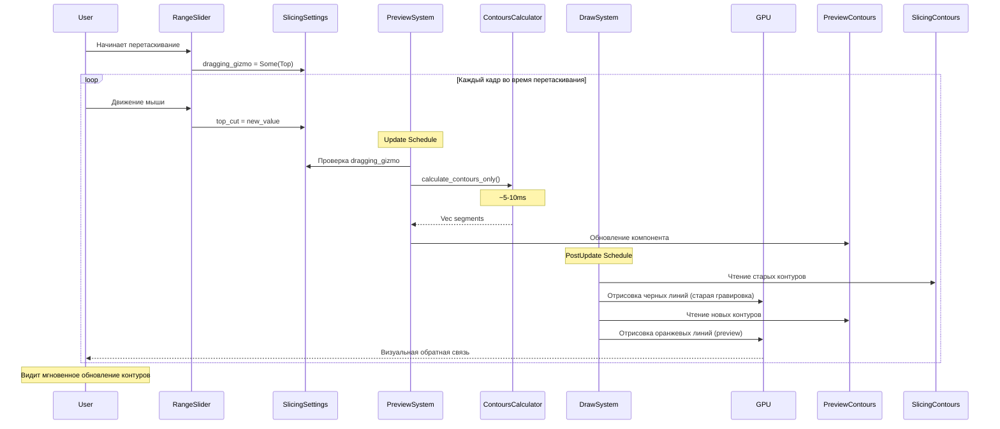

### Сценарий 2: Подтверждение изменений (Full Slicing)

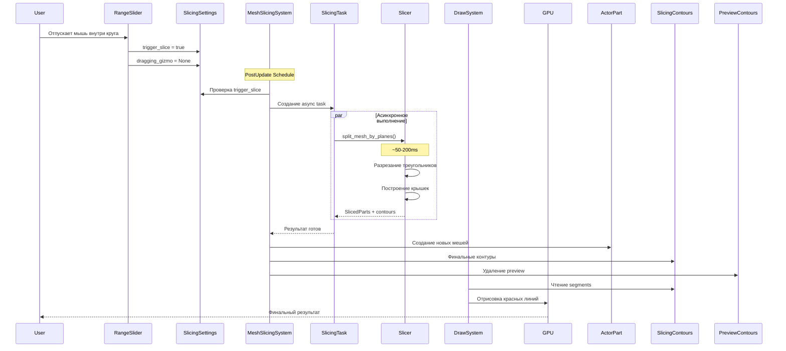

### Сценарий 3: Отмена изменений (Release Outside)

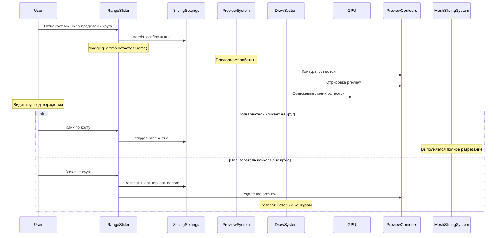

---

## 4. Сравнение производительности

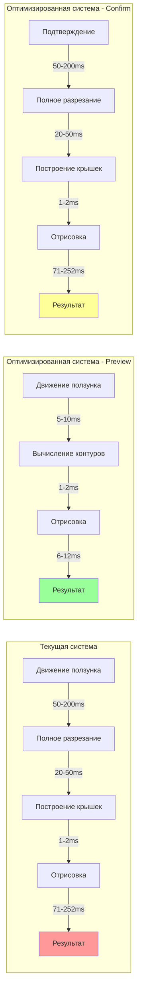

### Метрики

| Операция | Текущая система | Оптимизированная (Preview) | Улучшение |
|----------|----------------|---------------------------|-----------|
| Движение ползунка | 71-252ms | 6-12ms | **10-20x** |
| FPS при перетаскивании | 4-14 FPS | 83-166 FPS | **20-40x** |
| Подтверждение | 71-252ms | 71-252ms | 1x (без изменений) |

---

## 5. Архитектура компонентов

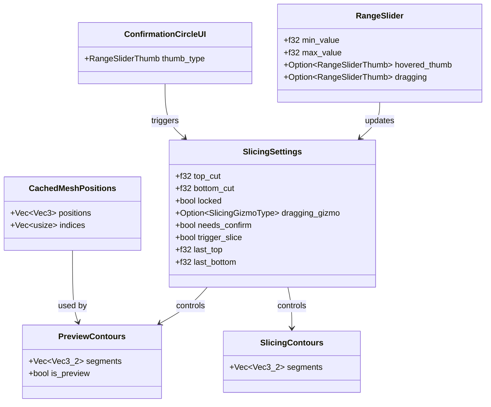

---

## 6. Диаграмма состояний механизма подтверждения

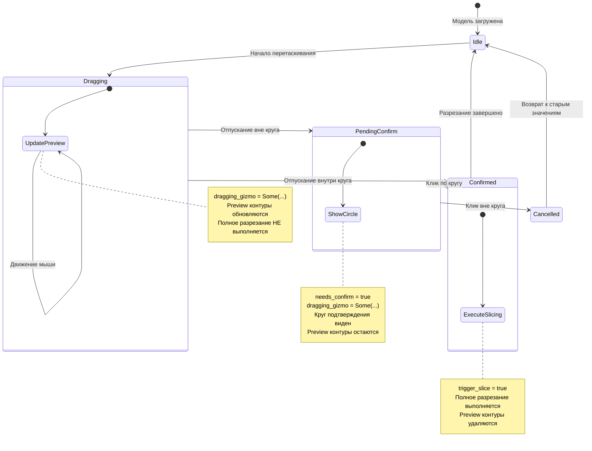

---

## 7. Диаграмма файловой структуры

```
crates/client_core/src/actor_editor/
│
├── mod.rs
│   ├── [ИЗМЕНЕНИЕ] Добавить PreviewContours компонент
│   ├── [ИЗМЕНЕНИЕ] Добавить CachedMeshPositions компонент
│   └── [ИЗМЕНЕНИЕ] Обновить порядок систем
│
├── widgets/
│   └── sliders.rs
│       └── [БЕЗ ИЗМЕНЕНИЙ] Механизм подтверждения уже работает
│
├── systems/
│   ├── slicing.rs
│   │   └── [ИЗМЕНЕНИЕ] Добавить проверку dragging_gizmo
│   │
│   ├── sync.rs
│   │   └── [ИЗМЕНЕНИЕ] Обновить draw_slicing_contours_system
│   │
│   └── preview_contours.rs
│       └── [НОВЫЙ] Система быстрого вычисления контуров
│
└── geometry/
    ├── slicer.rs
    │   └── [БЕЗ ИЗМЕНЕНИЙ] Полное разрезание
    │
    ├── capper.rs
    │   └── [БЕЗ ИЗМЕНЕНИЙ] Построение крышек
    │
    └── contour_calculator.rs
        └── [НОВЫЙ] Быстрое вычисление только контуров
```

---

## 8. Диаграмма взаимодействия систем

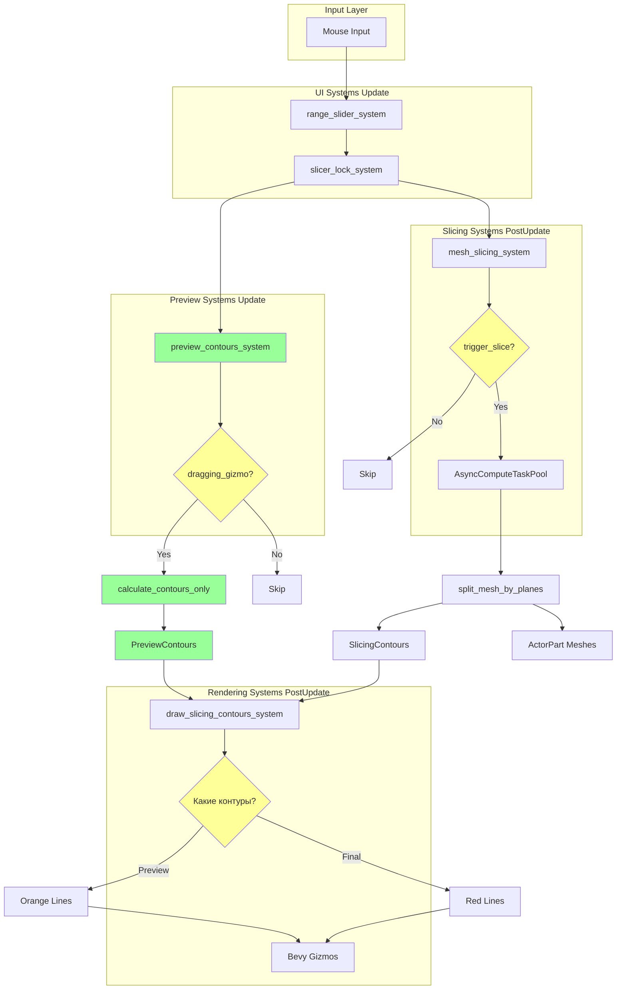

---

## 9. Временная диаграмма выполнения

```mermaid
gantt
    title Сравнение времени выполнения операций
    dateFormat X
    axisFormat %L ms
    
    section Текущая система
    Движение ползунка 1    :a1, 0, 71ms
    Движение ползунка 2    :a2, after a1, 71ms
    Движение ползунка 3    :a3, after a2, 71ms
    Подтверждение          :a4, after a3, 71ms
    
    section Оптимизированная
    Движение ползунка 1    :b1, 0, 6ms
    Движение ползунка 2    :b2, after b1, 6ms
    Движение ползунка 3    :b3, after b2, 6ms
    Подтверждение          :b4, after b3, 71ms
```

**Итого:**
- Текущая: 4 операции × 71ms = **284ms**
- Оптимизированная: 3 × 6ms + 1 × 71ms = **89ms**
- **Экономия: 195ms (68%)**

---

## 10. Диаграмма принятия решений

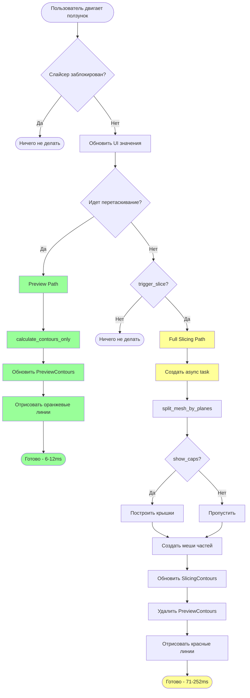

---

## Заключение

Диаграммы демонстрируют:

1. **Четкое разделение** между preview и full slicing путями
2. **Условное выполнение** тяжелых операций только при необходимости
3. **Асинхронность** для предотвращения блокировки UI
4. **Визуальную обратную связь** через разные цвета контуров
5. **Значительное улучшение производительности** (10-20x) во время перетаскивания

Архитектура спроектирована для:
- Минимальных изменений существующего кода
- Максимальной производительности в интерактивном режиме
- Сохранения точности при финальном разрезании
- Хорошей расширяемости для будущих оптимизаций
