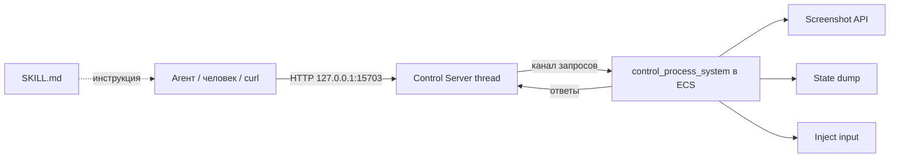

# 🛠 Control Server — агент-управляемая среда (HTTP API + Skill)

> **Статус:** ✅ Фаза 1 реализована (2026-09-26); Фазы 2–3 в бэклоге
>
> Реализовано: `client_core::control` (HTTP на 127.0.0.1:15703, вкл. в debug/
> флагом в release), `/state`, `/screenshot`, `/key`, `/mouse`, `/ui_click`,
> `/ui_hover`; скил `.agents/skills/klep2tron-control/` (+ `scripts/preview_check.py`).
> Подробности и известное ограничение RTT-превью — в
> [Preview_RTT_Thumbnails_Bug.md](Preview_RTT_Thumbnails_Bug.md).
> **Дата:** 2026-09-26
> **Тип задачи:** Инфраструктура отладки/автоматизации
> **Связанные документы:** [ENGINEERING_PROTOCOL.md](../docs/ENGINEERING_PROTOCOL.md), [PROJECT_MAP.md](../docs/PROJECT_MAP.md)

---

## 1. Зачем

Сейчас агент (ИИ) **слеп**: не видит окно, не может нажать кнопку, не знает состояние мира. Из-за этого отладка визуальных регрессий (например, «бокс на позицию выше») идёт вслепую.

Цель — дать агенту возможность **делать в программе всё, что может человек**: ходить по меню, играть, создавать карты/уровни, и **видеть** не только картинку, но и то, что рисуется (сущности, трансформы, меши, материалы, текстуры).

Интерфейс — **локальный HTTP API** + **Skill** (`SKILL.md`) с инструкцией. Любой агент с `curl`/HTTP может этим пользоваться; MCP не нужен (в pi нет MCP-клиента, а Skill покрывает задачу без лишнего слоя).

---

## 2. Архитектура



- **Control Server** — отдельный поток `std::net::TcpListener` с минимальным HTTP (без tokio), связь с ECS через канал.
- **control_process_system** — в `Update`, дренирует очередь, отвечает. Скриншот — через `Screenshot::primary_window()`.
- Оба бинарника (`client`, `editor_client`) используют `client_core`, поэтому модуль живёт там.

Включение:
- **debug** — по умолчанию `enabled = true`;
- **release** — по умолчанию `false`, включается флагом в `settings.json`:

```jsonc
"control": { "enabled": true, "port": 15703, "token": null }
```

Привязка только к `127.0.0.1`. При желании — токен в заголовке.

---

## 3. API (Фаза 1)

| Метод | Путь | Назначение |
|---|---|---|
| GET | `/state` | `GameState`, `EditorMode`, `Selection`, текущая комната, карта (h/тип), сущности с `Transform`, FPS |
| GET | `/screenshot` | PNG текущего кадра (`Screenshot::primary_window`) |
| POST | `/key` | `{"key":"ArrowUp","action":"tap"\|"press"\|"release"}` |
| POST | `/mouse` | `{"x":.., "y":.., "button":"left", "action":"click"\|"move"}` |
| POST | `/ui_click` | `{"label":"LEVEL EDITOR"}` — нажать кнопку по тексту |
| POST | `/action` | `{"action":"StartEditor"\|"LoadMap"\|...}` — прямое действие редактора |

Фаза 2: `/scene_tree`, `/mesh/{entity}`, `/material/{entity}`, `/texture/{handle}`.
Фаза 3: `/record` (серия действий → GIF/кадры), gamepad, MCP-обёртка при необходимости.

---

## 4. Skill

`docs/skills/klep2tron-control/SKILL.md` (+ `scripts/kctl.sh` — обёртка над curl).
Frontmatter: `name`, `description` с указанием, **когда** применять.
Содержит: запуск, endpoints с примерами, типовые сценарии («пройти меню», «поставить тайл», «снять скриншот»), чтение состояния.

---

## 5. Риски

| Риск | Митигация |
|---|---|
| Сервер может «нажимать кнопки» — безопасность | только 127.0.0.1, в release off, опц. токен |
| Скриншот не успевает к ответу | асинхронно: запрос → ожидание файла/`oneshot` с таймаутом |
| `Interaction`/ввод не срабатывают в тот же кадр | очередь применяется в начале `Update`, сброс через N кадров |
| Блокировка HTTP-потока | один запрос = одно ожидание с таймаутом, поток не блокирует ECS |
| Release-сборка: лишний код | модуль под `cfg(not(wasm))`, в рантайме выключен флагом |

---

## 6. Критерии готовности (Фаза 1)

- [ ] Оба бинарника поднимают сервер в debug, не поднимают в release без флага.
- [ ] `GET /screenshot` сохраняет файл, агент видит картинку.
- [ ] `GET /state` отдаёт карту/селект/сущности.
- [ ] `POST /key`, `/mouse`, `/ui_click` реально двигают меню/игру/редактор.
- [ ] `SKILL.md` позволяет агенту без дополнительного контекста выполнить типовой сценарий.
