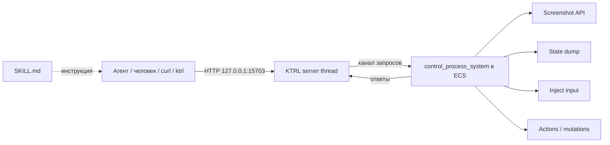

# 🛠 KTRL — Klep2tron Control Server (HTTP API + Skill)

> **Статус:** Фазы 1, 1.5 и 2 ✅ (2026-09-26); Фаза 3 в бэклоге
> **Дата:** 2026-09-26
> **Тип задачи:** Инфраструктура отладки/автоматизации
> **Предыдущее имя плана:** `Control_Server_Plan.md` (переименован, история та же)
> **Связанные документы:** [ENGINEERING_PROTOCOL.md](../docs/ENGINEERING_PROTOCOL.md), [PROJECT_MAP.md](../docs/PROJECT_MAP.md), [Preview_RTT_Thumbnails_Bug.md](Preview_RTT_Thumbnails_Bug.md)

---

## 0. Имя и соглашения

**KTRL** = **K**lep2**tr**on Contro**l** Server. Читается «контрол».

| Сущность | Имя |
|---|---|
| Компонент/протокол | Klep2tron Control Server (KTRL) |
| Rust-модуль | `client_core::control` (переименовывать не обязательно) |
| API-версия (заголовок `/version`) | `ktrls/1` |
| CLI-обёртка (Фаза 2) | `ktrl` |
| Skill | `.agents/skills/klep2tron-control/` (остаётся) |
| Порт | `127.0.0.1:15703` (не меняем) |
| Логи | префикс `KTRL:` |

## 1. Зачем

Агент (ИИ) не видит окно, не может нажать кнопку, не знает состояние мира — отладка визуальных регрессий («бокс на позицию выше») идёт вслепую.

Цель — дать агенту делать в программе всё, что может человек, и **видеть** не только картинку, но и структуру сцены (сущности, трансформы, меши, материалы, текстуры).

Интерфейс — **локальный HTTP API** + **Skill** с инструкцией. MCP не нужен.

---

## 2. Архитектура



- **KTRL server** — поток `std::net::TcpListener` с минимальным HTTP (без tokio), связь с ECS через канал.
- **control_process_system** — в `PreUpdate` (после `InputSystems`), дренирует очередь, отвечает.
- Оба бинарника (`client`, `editor_client`) используют `client_core`.

Включение:
- **debug** — по умолчанию `enabled = true`;
- **release** — `false`, флаг в `settings.json`:

```jsonc
"control": { "enabled": true, "port": 15703, "token": null }
```

Привязка только к `127.0.0.1`.

---

## 3. Фаза 1 — сделано (2026-09-26)

Источник: `crates/client_core/src/control/mod.rs`.

| Метод | Путь | Статус |
|---|---|---|
| GET | `/state` | ✅ `GameState`, `EditorMode.is_active`, `Selection`, комната + `cells[x][z]`, сущности (`Transform`) |
| GET | `/screenshot` | ✅ PNG текущего кадра |
| POST | `/key` | ✅ tap / press / release |
| POST | `/mouse` | ✅ move / button click |
| POST | `/ui_click`, `/ui_hover` | ✅ по `Name` или тексту |

Скил: `.agents/skills/klep2tron-control/` (+ `scripts/preview_check.py`, `scripts/editor_smoke.sh`).

Критерии Фазы 1 — выполнены: сервер поднимается в debug, не поднимается в release без флага; скриншот/состояние/ввод работают; скил позволяет пройти типовой сценарий без доп. контекста.

---

## 4. Фаза 1.5 — детерминизм, `/action`, быстрые дыры ✅ (2026-09-26)

Цель: убрать `sleep 0.3`-флаки и дать агенту прямые действия.

| # | Что | Статус |
|---|---|---|
| 1.5.1 | `/pause` `{"on":true}` — пауза `Time<Virtual>` (рендер/ввод живут) | ✅ |
| 1.5.2 | `/step` `{"frames":N}` — рендер ровно N кадров, ответ после завершения (N ≤ 120) | ✅ |
| 1.5.3 | `frame`/`paused` в `/state` — барьер вместо sleep | ✅ |
| 1.5.4 | `/action` — `ControlAction` (lifecycle в `client_core`, карта в `editor_client`) | ✅ |
| 1.5.5 | `/state`: FPS | ✅ |
| 1.5.6 | `/state`: размер комнаты из `cells.len()`, без хардкода `0..16` | ✅ |
| 1.5.7 | `/state`: `Name` сущностей + `entities_truncated` | ✅ |
| 1.5.8 | `/state`: режим редактора (`tool`, `undo`, `redo`) через `ControlExtras` | ✅ |
| 1.5.9 | `/ui_query` — label + rect + `Interaction`, фильтр `?label=` | ✅ |
| 1.5.10 | `/version` — `{"name":"KTRL","server":"ktrls","api":1,"binary":…}` | ✅ |

Реализация: `crates/client_core/src/control/` (`mod.rs`, `http.rs`, `state.rs`,
`keys.rs`, `config.rs`), `crates/editor_client/src/control_actions.rs`,
`TileType::parse` в `crates/client_core/src/lib.rs`. Смоук-тест
`scripts/editor_smoke.sh` переписан на `/step` (без `sleep`).

---

## 5. Фаза 2 — интроспекция сцены и адресный рендер

| # | Что | Статус |
|---|---|---|
| 2.1 | `/scene_tree` — дерево сущностей с `Name`, `kind`, детьми; бюджет узлов | ✅ |
| 2.2 | `/entity/{id}` — компоненты, `Transform`, mesh/material handle, `render_target` | ✅ |
| 2.3 | `/mesh/{id}` (атрибуты, вершины, индексы, топология), `/material/{id}` (цвета, roughness, textures) | ✅ |
| 2.4 | `/screenshot?view=camera:<id>` / `rtt:<id>` — снять конкретную камеру | ✅ |
| 2.5 | Offscreen-захват image-render-target камер (работает при перекрытом окне) | ✅ |
| 2.6 | CLI `ktrl` (`crates/ktrl`: `ktrl::Client` на ureq + clap-бинарь) | ✅ |
| 2.7 | Токен (`token` в конфиге / `KLEP_CONTROL_TOKEN`, `Authorization: Bearer`) | ✅ |
| 2.8 | Тесты KTRL: юнит-тесты `parse_request`/auth; интеграционный смоук | ✅ (юнит) / ⏳ (интегр.) |

Реализация: `crates/client_core/src/control/scene.rs` (интроспекция +`capture`),
`http.rs` (маршруты, токен), `config.rs` (token); RTT-изображения редактора
получили `TextureUsages::COPY_SRC` (`crates/editor_client/src/lib.rs`).
Клиент/CLI: `crates/ktrl` (`Client`, подкоманды `state`/`tree`/`entity`/
`mesh`/`material`/`shot`/`ui`/`action`/`set-tile`/`key`/`click`/`pause`/`step`).

---

## 6. Фаза 3 — мутации, запись, прочее (бэклог)

- **Мутации:** спавн/despawn, запись `Transform`, установка типа тайла, выделение — фикстуры для тестов без кликов.
- **`/record`:** серия действий → GIF/кадры.
- **Поток событий:** SSE/WebSocket (`state_changed`, `log`, `panic`) вместо блокирующего «запрос-ответ».
- **`POST /batch`:** список шагов одним запросом.
- **Gamepad**, текстовый ввод в поля (`/text`), MCP-обёртка — только если реально понадобится.

---

## 7. Риски

| Риск | Митигация |
|---|---|
| Сервер может «нажимать кнопки» — безопасность | только `127.0.0.1`, в release off, токен (Фаза 2.7) |
| Скриншот не успевает к ответу | `oneshot`/канал с таймаутом (уже так) |
| `Interaction`/ввод не срабатывают в тот же кадр | очередь применяется в `PreUpdate`, сброс через N кадров (уже так) |
| Пауза ломает геймплейные таймеры | пауза только для отладки и явным флагом, по умолчанию сервер не паузит |
| Приватное API в release | код под `cfg(not(wasm32))`, в рантайме выключен флагом |

---

## 8. Критерии готовности Фазы 1.5

- [x] `POST /pause` + `POST /step` дают скриншот ровно с нужного кадра; `editor_smoke.sh` переписан без `sleep`.
- [x] `POST /action` переводит в редактор / грузит карту / ставит тайл без кликов.
- [x] `/state` отдаёт FPS, реальный размер комнаты, `Name` сущностей, режим редактора.
- [x] `GET /version` отвечает `ktrls/1` и именем бинарника.
- [x] `docs/PROJECT_MAP.md` и `.agents/skills/klep2tron-control/SKILL.md` обновлены.
