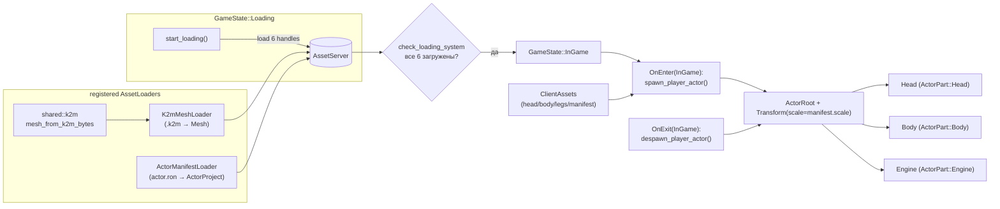

# 🎭 Спавн и отображение героя (Actor) в игровом клиенте

> **Статус:** ✅ ВЫПОЛНЕНО
> **Дата:** 2026-09-27
> **Ветка:** `feat/bevy-0.19`
> **Компонент:** `client_core/src/actor`, `shared/src/k2m.rs`
> **Связанные документы:** [Actor_Storage_Format.md](../docs/Actor_Storage_Format.md),
> [PROJECT_MAP.md](../docs/PROJECT_MAP.md), [GDD.md](../docs/design/GDD.md) §6,
> [ROADMAP ActorEditor](../docs/Future_Features/NPC/ActorEditor/todo/ROADMAP.md)

---

## 1. Цель и проблема

**Проблема.** Модель героя (`Robot`) уже запечена редактором и лежит в
`assets/actors/Robot/{head,body,legs}.k2m` + `actor.ron`, но игровой клиент её
не загружает и не отображает:

* парсер `.k2m` существует **только** в `actor_editor/src/systems/export.rs`;
* `client_core` не знает ни про `.k2m`, ни про `actors/`;
* в `GameState::InGame` спавнятся только тайлы/камера/свет (`world/mod.rs`,
  `rendering/mod.rs`), ни одного актора.

**Цель.** При входе в игру герой-робот появляется на полу стартовой комнаты,
собранный из трёх запечённых частей (`Head`/`Body`/`Engine`), с масштабом из
`actor.ron`. Без физики и управления — только корректное отображение.

## 2. Сценарии использования (User Stories)

* **Как игрок**, я хочу видеть своего робота в комнате при старте, чтобы понять,
  что модель собрана и расположена правильно.
* **Как разработчик**, я хочу менять модель героя правкой `assets/actors/<Name>/`,
  чтобы не пересобирать клиент.

## 3. Требования и ограничения

* **Обязательно:** загрузка через `AssetServer` (не через `std::fs` из клиента),
  чтобы пути к ассетам резолвились штатно и работал WASM.
* **Обязательно:** `client_core` не должен зависеть от `actor_editor`
  (направление `shared ← client_core ← actor_editor`).
* **Запрещено:** дублировать разбор `.k2m` — единственная реализация формата
  живёт в `shared::k2m`.
* **Вне scope:** физика (`avian3d`), ввод (`leafwing`), сокеты/эффекты,
  поворот головы, смена материалов (задача 11 редактора).

## 4. Данные

Формат `actor.ron`/`.k2m` не меняется ([Actor_Storage_Format.md](../docs/Actor_Storage_Format.md)).
Рантайм-манифест — `ClientAssets.actor_manifest` + три `Handle<Mesh>`.

---

## 5. Архитектура (Engineering)

### Компоненты и ресурсы

| Тип | Имя | Где | Назначение |
|---|---|---|---|
| Ресурс | `PlayerActorConfig { dir: String }` | `client_core/src/actor/mod.rs` | Папка актора, по умолчанию `actors/Robot` |
| Компонент | `ActorRoot` | там же | Корень иерархии героя (маркер для деспавна) |
| Компонент | `ActorPart` | `shared::npc` (уже есть) | Метка части на дочерних мешах |
| Ассет | `ActorManifest(ActorProject)` | `client_core/src/actor/loader.rs` | Обёртка манифеста для `AssetServer` |
| Ассет-лоадер | `K2mMeshLoader` | там же | `Mesh` из `.k2m` (расширение `k2m`) |
| Ассет-лоадер | `ActorManifestLoader` | там же | `ActorProject` из `actor.ron` (расширение `actor.ron`) |
| Плагин | `ActorPlugin` | `client_core/src/actor/mod.rs` | Регистрация ассетов и систем |

### Диаграмма потока данных

### Fast path / Full path

Задача разовая (спавн один раз при входе в игру), поэтому деление на
fast/full path не применяется. Асинхронность обеспечивает `AssetServer`:
тяжёлый разбор `.k2m` идёт на пуле загрузчиков, игровой поток не блокируется.

### План интеграции

1. `shared/src/k2m.rs` — вынести разбор/сборку `.k2m` из
   `actor_editor/src/systems/export.rs`; `actor_editor` делегирует в `shared`.
2. `client_core/src/actor/loader.rs` — два `AssetLoader` + `ActorManifest`.
3. `client_core/src/actor/{mod,spawn}.rs` — плагин, ресурс, спавн/деспавн.
4. Расширить `ClientAssets` и `check_loading_system` (включить актора в прогресс).
5. Подключить `ActorPlugin` в `ClientCorePlugin`.
6. Проверка: `cargo check --workspace`, `cargo test --workspace --no-run`,
   запуск клиента + скриншот через KTRL.

## 6. Тестирование

* **Unit:** `shared::k2m` — round-trip `mesh → bytes → mesh` (позиции/нормали/UV/индексы)
  и отказ на битой магии (`cargo test -p shared`, 2 теста — ✅).
* **Интеграция:** `GET /state` после старта показывает сущности-части актора;
  `GET /screenshot` — робот видим в центре комнаты.

## 7. Итог реализации (2026-09-27)

**Сделано:**

* `shared/src/k2m.rs` — единая реализация формата (`mesh_from_k2m_bytes`,
  `mesh_to_k2m_bytes`, fs-обёртки). `actor_editor/src/systems/export.rs` теперь
  делегирует в `shared::k2m` (дублирование устранено).
* `client_core/src/actor/loader.rs` — `K2mMeshLoader` (`.k2m` → `Mesh`) и
  `ActorManifestLoader` (`actor.ron` → `ActorManifest(ActorProject)`).
* `client_core/src/actor/{mod,spawn}.rs` — `ActorPlugin`, `PlayerActorConfig`,
  `ActorRoot`, `spawn_player_actor`/`despawn_player_actor`.
* `ClientAssets` расширен хендлами актора; `check_loading_system` ждёт 6 ассетов
  и не зависает при ошибке загрузки (fails gracefully).
* Посадка на пол: корень смещается на `-min_vertex_y * scale`, поэтому ступни
  точно на поверхности (без угадывания origin модели).

**Проверка (KTRL control API):**

* `cargo check --workspace` и `cargo test --workspace --no-run` — ✅.
* `cargo run -p client` → `POST /action {"action":"StartGame"}` →
  `/state` содержит `Actor: Robot` + `Engine`/`Body`/`Head`.
* `/mesh/454` — голова 12138 вершин, `/mesh/452` — двигатель 14616 вершин
  (реальные запечённые меши, не заглушки).
* `/screenshot` — робот собран (голубая голова, белый корпус, оранжевый
  двигатель) и стоит на полу. Синий куб рядом — тайл высоты 4 (радужная
  палитра `get_rainbow_color`), не актор.

**Осталось вне scope:** сокеты/эффекты из `actor.ron` (`config.sockets`),
физика (`avian3d`), управление (`leafwing`), поворот головы, смена материалов
(задача 11 редактора) — следующими планами.
