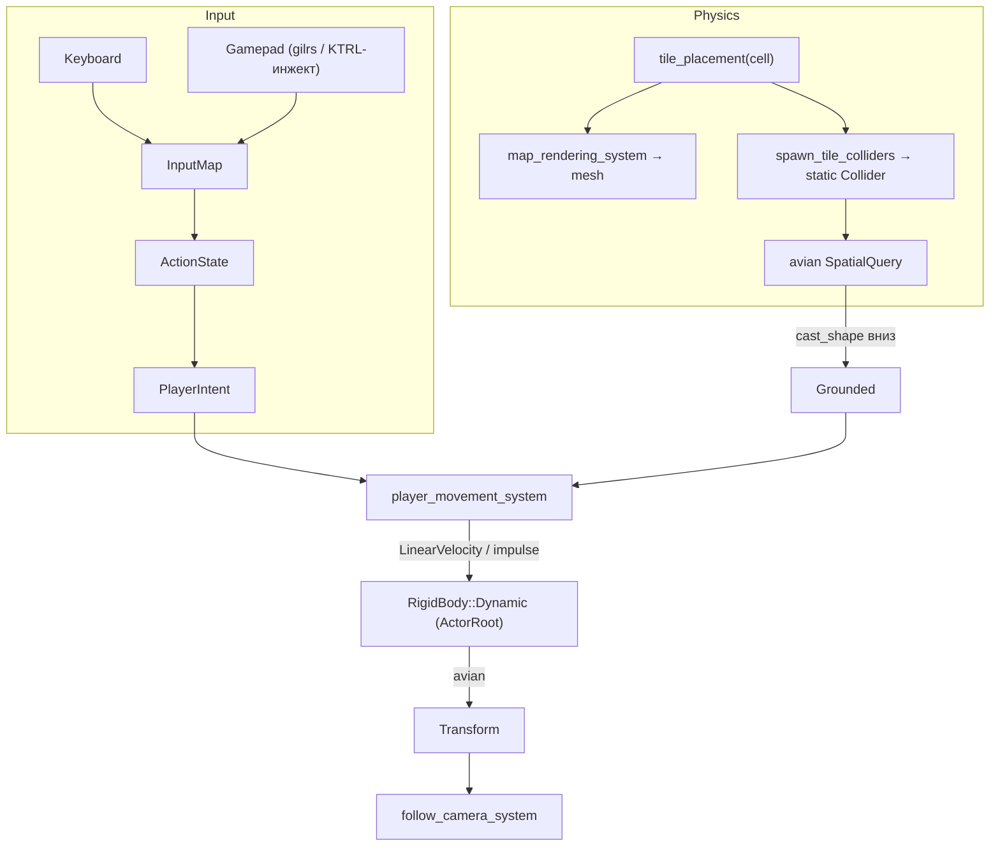

# 🕹️ Физика и управление героем

> **Статус:** ✅ ВЫПОЛНЕНО
> **Дата:** 2026-09-27
> **Ветка:** `feat/bevy-0.19`
> **Компонент:** `client_core/src/physics`, `client_core/src/input`, `client_core/src/actor`
> **Связанные документы:** [GDD.md](../docs/design/GDD.md) §2/§6,
> [PROJECT_MAP.md](../docs/PROJECT_MAP.md), [Bevy019_Migration_Plan.md](Bevy019_Migration_Plan.md),
> [Player_Actor_Spawning.md](Player_Actor_Spawning.md)

---

## 1. Цель и проблема

**Проблема.** Герой (`ActorRoot`) — статичная сущность без физики: тайлы
отрисованы, но не имеют коллайдеров, гравитации нет, ввод не реализован.

**Цель.** Робот падает на поверхность комнаты и управляется клавиатурой
(WASD/стрелки + Space) и геймпадом (левый стик + A/South), камера следует за ним.

## 2. Требования и ограничения

* **Обязательно:** физика совпадает с картинкой — коллайдер тайла строится тем
  же трансформом, что и меш (единый `tile_placement`).
* **Обязательно:** ввод абстрагирован (`PlayerAction`), чтобы позже перенести на
  авторитарный сервер (`bevy_renet`, out of scope).
* **Обязательно:** работает на нативе; WASM-сборка не должна ломаться.
* **Запрещено:** читать `ButtonInput` напрямую из системы движения.
* **Зависимости:** `avian3d 0.7`, `leafwing-input-manager 0.21` (Bevy 0.19).

---

## 3. Архитектура (Engineering)

### Компоненты и ресурсы

| Тип | Имя | Где | Назначение |
|---|---|---|---|
| Плагин | `GamePhysicsPlugin` | `physics/mod.rs` | `PhysicsPlugins`, коллайдеры тайлов |
| Плагин | `PlayerInputPlugin` | `input/player.rs` | `InputManagerPlugin`, `InputMap` |
| Компонент | `TileCollider` | `physics/colliders.rs` | Метка динамических коллайдеров тайлов |
| Компонент | `PlayerIntent` | `input/player.rs` | Намерение движения (напр. `Vec2`, `jump: bool`) |
| Ресурс | `PlayerAction` (enum) | `input/player.rs` | Абстрактные действия |
| Ресурс | `InputMap<PlayerAction>` | `input/player.rs` | Клавиатура + геймпад |
| Компонент | `Grounded` | `physics/mod.rs` | Результат shape-cast вниз |

### Единый трансформ тайла

`TilePlacement { translation, scale, rotation }` в `rendering/tile_geometry.rs`.
Используется и `map_rendering_system` (меши), и `physics::colliders` (коллайдеры).
Для `Cube` — `cuboid(1, h*0.5+0.5, 1)`; для `Wedge*` — колонна-кубоид +
`Collider::convex_hull` из вершин `wedge.obj` с тем же поворотом/масштабом.

### Диаграмма потока

### Fast path / Full path

* **Fast path:** движение и прыжок — каждый кадр, только чтение ввода и запись
  `LinearVelocity`, без создания сущностей.
* **Full path:** генерация коллайдеров комнаты — один раз на смену комнаты
  (деспавн всех `TileCollider` + спавн заново).

## 4. План интеграции

| Этап | Содержание | Проверка |
|---|---|---|
| 1 | `avian3d`, `tile_placement`, коллайдеры тайлов | тайлы твёрдые, `GET /scene_tree` |
| 2 | физтело актора, спавн над полом | `/watch` y ≤ пол, `/state` |
| 3 | `leafwing` + `PlayerAction` + движение/прыжок | `POST /key` проходит по комнате |
| 4 | геймпад-маппинг | `POST /gamepad` |
| 5 | follow-камера | `/screenshot` |

## 5. Тестирование

* Unit: `tile_placement` для `Cube`/`Wedge*` (трансформ совпадает с рендером).
* Интеграция (KTRL): падение через `/watch`; клавиатура — `POST /key`;
  геймпад — `POST /gamepad`; визуально — `/screenshot`.

## 6. Вне scope

Сеть/авторитарный сервер (`bevy_renet`), порталы между комнатами (GDD §2),
поворот головы, сокеты, редактор карт (он использует свою логику).

## 7. Итог реализации (2026-09-27)

**Сделано:**

* `Cargo.toml`: `avian3d = "0.7"`, `leafwing-input-manager = "0.21"`.
* `rendering/tile_geometry.rs` — единый `TilePlacement` для меша и коллайдера;
  `map_rendering_system` отрефакторен на него (3 unit-теста).
* `physics/{mod,colliders}.rs` — `GamePhysicsPlugin` (`PhysicsPlugins`),
  статические коллайдеры тайлов (Cube → `cuboid`, Wedge → колонна +
  `convex_hull` из вершин), пересборка на смену комнаты/карты, `PlayerBody`.
* `actor/spawn.rs` — физтело: `RigidBody::Dynamic`, `Collider::cylinder` из
  габаритов модели, `LockedAxes::ROTATION_LOCKED`, спавн с `DROP_HEIGHT = 2.0`,
  модель — на дочернем pivot со scale (коллайдер в world-единицах, scale ONE).
* `input/player.rs` — `PlayerAction { Move (DualAxis), Jump }`, маппинг
  WASD/стрелки/Space + левый стик/A; `player_movement_system` задаёт скорость и
  прыжок по shape-cast/ray вниз (`SpatialQuery`).
* `world/mod.rs` — `FollowCamera` + `follow_player_camera_system`.

**Проверка (KTRL):**

* Падение: спавн y=3.96 → приземление y=1.979 (= пол 1.5 + h/2), стоит.
  `r=0.360, h=0.958` — из реальных габаритов модели.
* Клавиатура: `POST /key W press` → z 2.0→0.86 (−Z), `D` → x 2.0→4.14 (+X),
  падение на нижние тайлы (y 0.979 на h=1).
* Геймпад: `POST /gamepad south tap` → прыжок ровно на 1 тайл
  (y 0.979→1.966→0.979); левый стик (`axis leftstickx`) двигает по +X.
* Камера: `/screenshot` — герой по центру кадра.
* `cargo check --workspace`, `cargo test --workspace --no-run`,
  `cargo check -p client_web --target wasm32-unknown-unknown` — ✅.

**Найденные грабли:**

1. Avian масштабирует коллайдер через `Transform.scale` — держим физкорень в
   scale `ONE`, масштаб модели — на дочернем pivot.
2. `Vec3::min`/`max` дали некорректные (частично «плоские») границы на больших
   буферах вершин в этом наборе фич; AABB считаем покомпонентно
   (`f32::min`/`max`) в `model_bounds`.
3. Спавн актора теперь ждёт, пока меши реально появятся в `Assets<Mesh>`
   (иначе брались габариты-заглушки).

**Ограничение инструмента:** KTRL применяет все запросы одного кадра сразу и не
умеет «удерживать» ось геймпада; стик проверялся серией инъекций с паузой ~20 мс.
